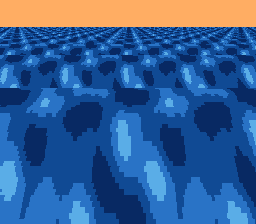
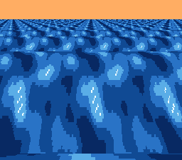

# Super Waverace

A Mode 7 style SNES game — a wave racer where the sea itself rolls, using per-scanline zoom/position tricks to fake a sinusoidal ocean on hardware that can only rotate and scale a flat plane.

## Status

🌊 Phase 3 — the rolling sea works in Mode 7. See `docs/PLAN.md` for the roadmap
(target: [SNES DEV Game Jam 2026](https://itch.io/jam/snes-dev-game-jam-2026)).

 

The sea is a per-scanline raycast baked at build time (`tools/bake_tables.py`) into
HDMA tables: `TM` splits sky from sea, `M7A` sets perspective width, and — with the
matrix row zeroed — `M7Y` picks the exact texture row each scanline samples, so near
crests correctly occlude the water behind them. 32 baked phases cycle to roll the
swell (~28KB of ROM, near-zero CPU). D-pad up/down changes the sea speed.

## Building the ROM

The game (in `game/`) is built with [PVSnesLib 4.6.0](https://github.com/alekmaul/pvsneslib).
Output is `game/superwaverace.sfc` — LoROM, no SRAM, no enhancement chips, per the jam rules.

**Windows (Git Bash):**

```bash
winget install ezwinports.make   # once
./scripts/setup-windows.sh       # once: installs PVSnesLib to ~/pvsneslib + Git Bash patches
export PVSNESLIB_HOME=$HOME/pvsneslib
make -C game
```

**CI:** every push to `main` builds the ROM on Linux, uploads it as a workflow artifact,
and deploys the web player to the `gh-pages` branch.

## Play in the browser

**https://seanbouk.github.io/super-waverace/** — the latest ROM from `main`, running in
[EmulatorJS](https://emulatorjs.org/) (snes9x core). For local testing: build the ROM,
copy it into `web/`, and serve that folder with any static file server.

## Tools

### Wave Visualizer (`tools/wave-visualizer/`)

A self-contained web tool (open `index.html` in a browser) for getting the per-scanline raycast geometry right. Instead of defining the floor directly, each of the SNES's 224 scanlines casts a ray from the camera and records the *first* crossing with a sine wave — a top-to-bottom raycaster, so near crests correctly hide the troughs and waves behind them.

Four charts:

1. **The sea** — the sine wave itself (+x is into the distance, +z in game terms)
2. **The eye** — the 224 rays fanned out from the camera, truncated at their hit points
3. **First crossing** — per scanline, the lowest x where its ray meets the wave (plateaus = hidden water)
4. **SNES display** — the 224 scanlines shaded near→far, with misses as sky

Controls for camera height/pitch/FOV, wave amplitude/wavelength/phase, ray distance, and an animated rolling-sea mode.

**Simplification (deliberate):** the hit's x value is used for both "which part of the wave" and "how far away it is". True texture position (arc length) and true distance (ray length) differ slightly, but occlusion — the effect that matters — comes entirely from the first-crossing rule and stays exact.
